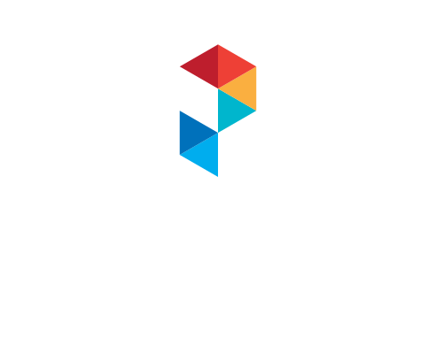
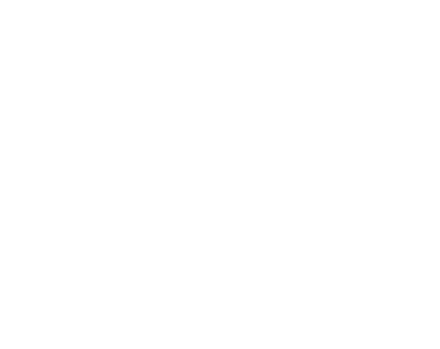

# Brand Assets

This page is intended to share the vital info that might be needed by Pluribus Digital staff, partners, etc. when referencing the company. For example, a partner might want our logo for a proposal, or we might need to share similar information when sponsoring an event.

See also:[Brand Guide & Voice](guide.md)

## Company Description

Pluribus Digital is a small woman-owned digital services firm serving the federal government. Government services are becoming less about paper and manual processing and more about providing services as great digital products. Pluribus helps government organizations with this digital service transformation with hands-on services.

* Development: We build cloud-based digital products and modernize legacy applications to support agility and mission effectiveness.
* DevOps: We automate technical delivery to improve quality and efficiency, and move toward a culture of automation and continuous delivery.
* Data: We unlock the value of data held within organizations, through data sharing and analytics capabilities.

... | Additional Details
------- | -----
Full Company Name | Solution Technology Systems, Inc. d/b/a Pluribus Digital
URL | [https://pluribusdigital.com/](https://pluribusdigital.com/)
Address | 1600 Wilson Blvd, Suite 1300 <br /> Arlington, VA 22209
Twitter | [@pluribusd](https://twitter.com/pluribusd)
LinkedIn | [PluribusDigital](https://www.linkedin.com/company/PluribusDigital/)
DUNS | 92-775-5033
CAGE Code | 1TAD9
GSA Schedule 70 Contract | GS‐35F‐404DA

### NAICS Codes

* 518210 – Data Processing, Hosting, and Related Services
* 541511 – Custom Computer Programming Services
* 541512 – Computer Systems Design Services
* 541519 – Other Computer Related Services
* 541611 – Administrative Management and General Management Consulting Services
* 541618 – Other Management Consulting Services
* 541690 – Other Scientific and Technical Consulting Services
* 541990 – All Other Professional, Scientific, and Technical Services
* 611420 – Computer Training

## Logos

### Logo Usage Guidelines

* _Do not change the logo._ Do not edit, re-arrange, re-color, change part of the text portion, etc. Do not change the aspect ratio (width as compared to height).

* _Use an appropriate file type for the medium._  Use vector formats (SVG) when possible. Use an appropriate resolution raster format (PNG) otherwise. Avoid pixelation or blurring by not using a too-small file.

* _Use an appropriate background color._ The color logo is meant to be set on very light (white or close) or very dark (black or close) backgrounds. The single-color versions can be used in a wider variety of backgrounds.

### Logo Variations

Logos are available below. Note that some that are designed for dark backgrounds may display faintly or not at all. Click through to see the logo file or view the [parent directory](https://github.com/PluribusDigital/playbook/tree/main/branding). 

| Logo Format | Color on White | Color on Black | Black on White | White on Black |
| --- | --- | --- | --- | --- |
| **"P" (No Text)** |  |  |  |  |
| **"Tall" (Text Below)** |  |  |  |  |
| **"Wide" (Text to Right)** |  |  |  |  |


## Logo/Brand Colors

```
Dark Red
C: 15		R: 190
M: 100		G: 30
Y: 90		B: 45
K: 10		#be1e2d

Red
C: 0		R: 238
M: 90		G: 64
Y: 85		B: 54
K: 0		#ee4036

Orange
C: 0		R: 250
M: 35		G: 175
Y: 85		B: 64
K: 0		#faaf40

Turquoise
C: 80		R: 0
M: 0		G: 182
Y: 20		B: 205
K: 0		#00b6cd	

Dark Blue
C: 100		R: 0
M: 50		G: 113
Y: 0		B: 187
K: 0		#0071bb

Light Blue
C: 100		R: 0
M: 0		G: 173
Y: 0		B: 238
K: 0		#00adee
```

## Fonts

**Logo Fonts:** Proxima Nova Bold, Proxima Nova Medium

**Web Site Fonts:** Poppins (headers), Roboto (body)

