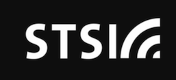

# Brand Assets

This page is intended to share the vital info that might be needed by STSI staff, partners, etc. when referencing the company. For example, a partner might want our logo for a proposal, or we might need to share similar information when sponsoring an event.

## Company Description

Solution Technology Systems, Inc. (STSI) is a small, steadily growing digital services firm serving the federal government. Government services are becoming less about paper and manual processing and more about providing services as great digital products. STSI helps government organizations with this digital service transformation with hands-on services.

* Development: We build cloud-based digital products and modernize legacy applications to support agility and mission effectiveness.
* DevOps: We automate technical delivery to improve quality and efficiency, and move toward a culture of automation and continuous delivery.
* Data: We unlock the value of data held within organizations, through data sharing and analytics capabilities.

... | Additional Details
------- | -----
Full Company Name | Solution Technology Systems, Inc.
Address | 1600 Wilson Blvd, Suite 1300   Arlington, VA 22209
DUNS | 92-775-5033
CAGE Code | 1TAD9
GSA Schedule 70 Contract | GS‐35F‐404DA

## Logos

### Color

[Large Color Logo PNG - 1356 x 438px](stsi_logo_large.png)

[Small Color Logo PNG - 200 x 65px](stsi_logo_200.png)

### White on Transparent

[Large Logo White-on-transparent 1865 x 603px](STSI_white_large.png) 

[Medium Logo White-on-transparent 500 x 162px](STSI_white_500x162.png) 

[Small Logo White-on-transparent 200 x 65px](STSI_white_200x65.png)
