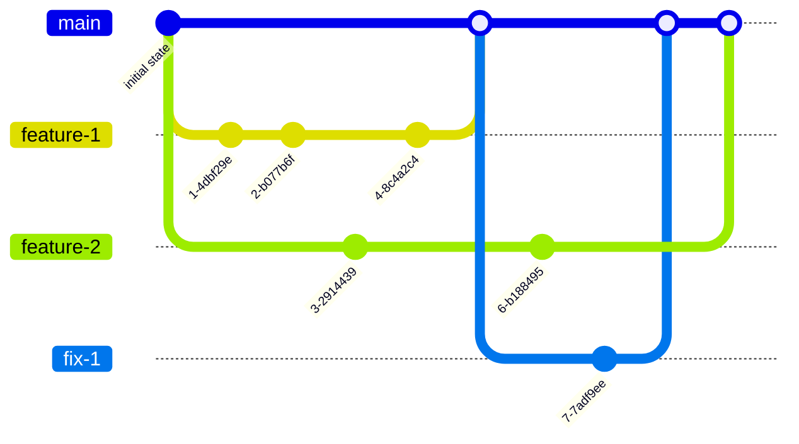

# Contributing Code

This guideline is designed to make contribution changes to the project run as smoothly and efficiently as possible, and also to recover or rollback as needed.

_NOTE: the workflow below is required for code changes but not documentation-only changes._ 

## Branching Strategy

We follow a modified version of [GitHub Flow](https://guides.github.com/introduction/flow/). This allows us to have a streamlined process that is aligned to a continuous delivery model, but also allows us to batch up related features into one release. The basics are:

- `main` branch is the latest set of merged changes.
- `[descriptive-name]` branches are branched from `main`, and represent a feature in progress until merged back into `main` via a pull request.

## Building New Features

1. Create a branch from main.

    - `git checkout main`
    - `git checkout -b feature/short-descriptive-name`

2. Make your changes and commit to local machine.

    - `git add .` : More info on [git add](https://git-scm.com/docs/git-add)
    - `git commit` : More info on [git commit](https://git-scm.com/docs/git-commit)
    - _NOTE: Follow the guideline for [writing a good commit message](http://chris.beams.io/posts/git-commit/)_
    - Repeat as needed while building the feature
    - Optionally push in-progress features to make work visible to team

3. Finalize the feature.

    - Make sure tests pass, etc.
    - Pull in the latest main branch to avoid merge conflicts
        `git pull origin main`
    - If necessary, resolve [Merge Conflicts](https://help.github.com/articles/resolving-a-merge-conflict-from-the-command-line/)

4. Push your new branch and open a pull request.

    - `git push -u origin feature/short-descriptive-name`: More info on [git push](https://git-scm.com/docs/git-push)
    - Using Github.com UI, submit a pull request for the new branch into `main`.
    - In the PR description include issue numbers (`Closes #1`)
    - Verify that CI checks pass.
    - Request a review (soliciting available reviewers in slack if needed).
    - Update your branch and re-push to fix any issues surfaced in the above steps.
    - More information on [Pull Request](https://help.github.com/articles/using-pull-requests/)

5. Merge the approved PR.

    - _NOTE: It is OK to approve/merge your own PR if it is only a documentation update._
    - Review the PR message to verify it is descriptive of the set of changes.
    - Reference story number as appropriate.
    - Select squash-merge option to merge back into `main`.

## Releasing Code

A merge into `main` will automatically trigger a deployment to the develop cloud environment.

With the exception of a hotfix, built code is promoted to higher environments from the above `main` build.
